# Purpose

- **Problem Statement:** Finding the right movie for a group of people can be challenging due to conflicting tastes and the vast number of options. Additionally, discovering interesting new movies within specific genres or based on mood can be time-consuming, especially when looking for the year's best releases.

- **Solution:** This project provides a command-line tool that streamlines movie selection and discovery. It focuses on curating a list of the top 50 best movies from the previous year (2023), leverages web scraping to gather movie information, offers filtering/selection options, and presents the results in a user-friendly format.

- **Key Objectives:**

   * **Efficiency:** Make the movie selection process faster and more enjoyable, specifically for highlighting top releases.
   * **Discovery:** Help users find acclaimed movies from the previous year.

# UX Design

Since the application is currently a simple command-line based, the UX focuses only on clarity of messages, ease of use:

- **Intuitive Commands:** Provide a clean and clear interface and messages to guide users through selection.
- **Informative Prompts:** Provide clear prompts to help users understand what input is expected at each stage.
- **Error Handling:** Display helpful error messages if the user enters invalid input or encounters unexpected issues.
- **Progress Indicators:** Let the user know the program is working (especially when fetching data from websites) to prevent confusion about whether it's running or stuck.

# Features

## Function Overview

The project currently contains five core functions that work together to achieve its movie selection and discovery goals:

- **`get_new_file_name()`**
    * **Purpose:** Interacts with the user to obtain a desired filename for storing scraped movie data.
    * **Functionality:** Prompts the user for input, potentially includes validation to ensure a valid filename is provided.

- **`reuse_or_create_html_file()`**
    * **Purpose:** Provides flexibility in managing scraped data by allowing the user to either reuse an existing HTML file or create a new one. 
    * **Functionality:**  
        *   Checks for existing HTML files. 
        *   Presents the user with options to view existing files and select one or create a new file. 

- **`scrapMyWeb()`** 
    * **Purpose:**  Orchestrates the core scraping process and interaction with Google Cloud Storage.
    * **Functionality:**
        *   Fetches the webpage containing movie information.
        *   Uploads the downloaded HTML contents to a  Google Cloud Storage bucket.
        *   Calls the `extract_movie_titles` function to process the stored data.

- **`extract_movie_titles()`**
    * **Purpose:**  Isolates and extracts the actual movie titles from the larger HTML document.
    * **Functionality:**
        *   Accesses the HTML file stored in Google Cloud Storage.
        *   Utilizes the BeautifulSoup library to parse the HTML structure. 
        *   Implements specific logic to identify and retrieve the relevant movie title elements.

- **`main()`**
    * **Purpose:** Acts as the entry point to application, coordinating the execution of other functions.
    * **Functionality:** 
        *   Contains the 'url' of the website that is used for Scraping.
        *   Prompts the user either to start the program or exit.
        *   Initiates the web scraping and movie title extraction process.

## Existing Features

- **Start Up Screen**

    

The startup screen prompts the user to either press 'Enter' to start the program or input 'exit' to quit. 

- **User pressed 'Enter' and existing html files are found**

    

When user presses 'Enter' and existing .html files are found in the same directory, the user can choose to view them.

- **User pressed 'Enter' and no existing html files are found**

    

When user presses 'Enter' and existing .html files are not found in the same directory, the user can choose a file name to scrap the web content to.

- **Viewing existing files**

    

When existing files are found in the program directory, the user if chooses 'y', can view those files.

- **View result**

    

When user either chooses an existing file (using file number) or creates a new one, a list of top 50 movies of 2023 is retrieved.

- **Exiting**

    

The user on several stages during the entire program has been given the option to exit by simply typing 'exit'.

- **Google cloud storage**

    - **Purpose:** Overcomes the limitations of Heroku's temporary storage by storing scraped movie data and HTML files within a persistent Google Cloud Storage bucket. This ensures data accessibility and longevity between program runs.
    - **APIs in Use:** Employs the Google Cloud Storage API to interact with the service. Key actions include:
        * **Uploading Files:** Transfers scraped HTML content to the cloud bucket for later processing.
        * **Retrie Files:** Retrieves stored HTML files containing movie information for title extraction.
        * **Libraries:** Utilizes the google-cloud-storage Python library, which provides a developer-friendly interface to interact with the Google Cloud Storage API.

# Technologies

## Languages

- Python

## Program, frameworks , libraries

- [Gitpod](https://gitpod.io/) IDE to develop the app.
- [GitHub](https://GitHub.com/) to host the source code 
- [Heroku](https://www.heroku.com/) to deploy and host the live app.
- Git to provide version control (to commit and push code to the repository). 
- [Google Cloud Storage API](https://cloud.google.com/storage/docs) Cloud storage solution.
- [requests]: HTTP requests (https://requests.readthedocs.io/en/latest/)
- [BeautifulSoup4]: HTML parsing (https://beautiful-soup-4.readthedocs.io/en/latest/)
- [google-cloud-storage]: Python client library (https://googleapis.dev/python/storage/latest/client.html)
- [PEP 8](http://pep8online.com/) to validate python code.
- Code Institute's Python Template to generate the workspace for the project.

# Deployment

## Github
The project was created on GitHub using the Code Institute template. Development occurred in Gitpod. 

## Version control
Git was used for version control. Changes were committed to the main branch of the GitHub repository. 
The following commands were used throughout the project:

git add . - new (or untracked), deleted and modified files are added to Git staging area
git commit -m "commit message" - to commit changes to the local repository
git push - to push all committed changes to the GitHub repository
git pull - to pull the changes from the remote branch and integrate them with the current local branch
git status - to display the state of the working directory and the staging area
git log - to display commits

## Heroku
- Heroku was used to host the app. Heroku is a container-based cloud Platform for building, deploying and managing apps. 
- A new Heroku app was created (movie-nite) using Heroku's Web-interface method.
- The [requirements.txt] (requirements.txt) file in the project root specifies the necessary Python libraries for Heroku's environment.

### Steps for deployment:

1. Fork or clone this repository.
2. Log into your account on Heroku.
3. Create a new Heroku app.
4. Navigate to `Settings` tab.
5. Set up environmental variables in `config vars` section. In this case, it's CREDS(credentials of Google service account) and Project ID.
5. Set the buildbacks to `python` and `NodeJS` in that order.
6. Configure GitHub integration, choose `main` branch in the `Deploy` tab.
6. Click `Deploy branch`.

# Testing

Testing was done both at my local machine level and when the program was deployed on Heroku.

## Testing done locally

### Debugging scenario 1: 
When user is prompted to choose either ‘y’ or ’n’. But the user choose an integer or any other special character. For this scenario, I gave ‘1’ as user input.

- **Expected behaviour:** when user enters Anything other then ‘y’ or ’n’, the program should break.

- **Result:** when I entered an integer (1 in this case), the program didn’t break and continued as before.

    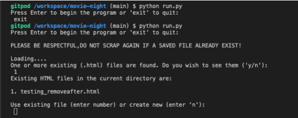

- **Fix:** Added a ‘While True’ loop to validate the user input.

    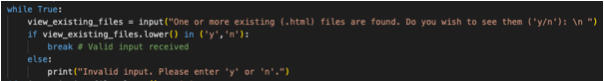

- **Result after the fix:** Program ‘Breaks’ outputting a message ‘Invalid input’ and prompt the user once again. 

    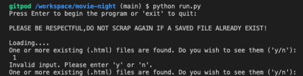

### Debugging scenario 2: 
When user is prompted to choose either a number or ’n’. But the user choose ‘y’ or any other letter.

- **Expected behaviour:** when user enters Anything other then ‘y’ or ’n’, the program should break and the user should output with a clear message.

- **Result:** when I entered ‘y’, the program printed a wrong/incomplete message.

    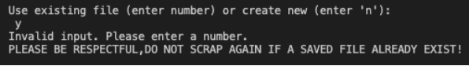

- **Fix:** Amended the print statement to display a clear error message.

- **Result after the fix:** Showed the right error message. 

    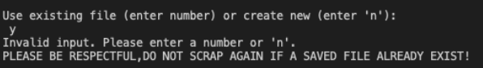

### Debugging scenario 3: 
The program is meant to print only first 50 movie titles from a list of 170 movie titles given in the webpage the program scraped and saved.

- **Expected behaviour:** The program was meant to output a list of first 50 movies when finished executing. 

- **Result:** The program was outputting all the 170+ movies.

- **Fix:** Used a counter to count until 50th movie in the list.

    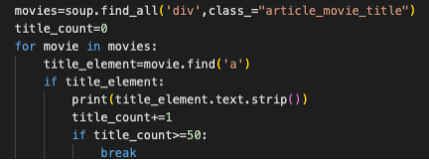

- **Result after the fix:** Program ‘Breaks’ after outputting list of first 50 titles. 

### Debugging scenario 4: 
No break points in the program. If user wants to exit the program mid way, so far it is not possible.

- **Expected behaviour:** whenever the user is prompted with the ‘Enter a desired file name’, the user has the option to exit the program and to give user the flexibility of exiting early. 

- **Result:** No option to exit the program and the word ‘exit’ is taken as a new file name instead of a command.

    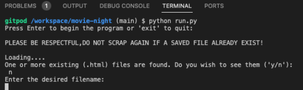

- **Fix:** Amended the code by adding an extra if condition and using the in-built exit( ) function.

    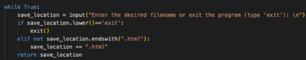

- **Result after the fix:** User can use the exit command to exit out of the program. 

    

### Problem 5:
Bad readability due to long lines of code.

- **Before the fix:** The program had only two main functions namely scrapMyWeb( ) and extract_movie_titles( ). This decreased readability a lot. Everything was cluttered. 

- **Fix:** Created two new functions out of the existing scrapMyWeb( ) function, namely get_new_file_name( ) and reuse_or_create_html_file( ). These two functions now entirely deals with  creating or reusing the html files. They are also classified under helper functions. 

- **Result after the fix:** Better readability.

## Testing on Heroku Platform

### Debugging scenario 6: 
Deploying the program on Heroku.

- **Expected behaviour:** App should successfully deploy and startup screen is displayed. 

- **Result:** Error received: No module named ‘requests’ is found.

    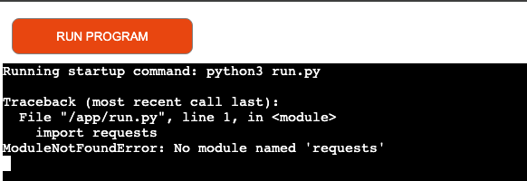

- **Fix:** Added ’requests' in the ‘requirements.txt’ file.

- **Result after the fix:** Fixed the 'module not found' error message 

    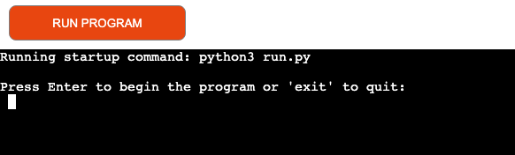

### Debugging scenario 7:
    **This debugging scenario was only applicable to the pre-release code version which was not adapted in the final version of the code. This scenario was used when i thought i could use Heroku's ephemeral filesystem to create and access files. But since that option was not viable for my program, i removed the use of tempfile library. But as a history , i still listed it here.**

Deploying the program on Heroku and pressed ‘ENTER’ to start.

- **Expected behaviour:** App should successfully run and prompt the user for some input. 

- **Result:** Error received: No such file or directory found.

    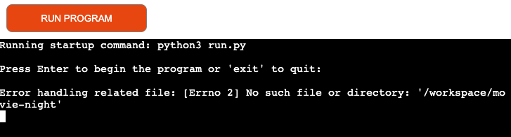

- **Fix:** Imported tempfile library and used its TemporaraDirectory( ) function.

    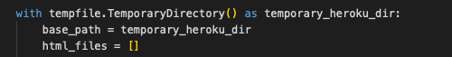

- **Result after the fix:** Program ran successfully to the next step and prompted the user for a filename or exit. 

    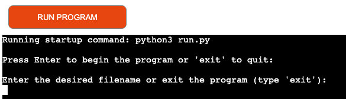

### Debugging scenario 8: 
Deploying the program on Heroku.

- **Expected behaviour:** App should successfully deploy and startup screen is displayed. 

- **Result:** Error received: 'json' is not defined.

    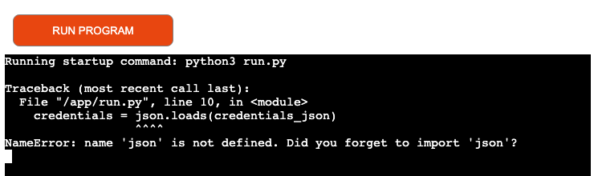

- **Fix:** Imported ’json' library.

- **Result after the fix:** Fixed the 'json not defined' error message 

    

# Credits

- Python Standard Library for os: https://docs.python.org/3/library/os.html
- Python Standard Library for time: https://docs.python.org/3/library/time.html
- Python Standard Library for json: https://docs.python.org/3/library/json.html
- Requests Library: https://requests.readthedocs.io/en/latest/
- Google Cloud Authentication: https://googleapis.dev/python/google-api-core/1.21.0/auth.html
- Google Cloud Storage Client Library: https://cloud.google.com/storage/docs/reference/libraries
- What are buckets and how to create them: https://cloud.google.com/storage/docs/buckets
- I have also used very commonly used code snippets for webscraping like:
    **response = requests.get(web_address)**
    **response.raise_for_status()**
- Code institute for providing template and initial know-how to work with Heroku.

# Acknowledgements

Special thanks to my mentor ' Mr. Ronan McClelland' for providing me with various materials and his valuable pointers.